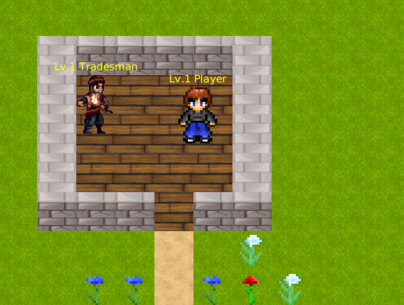
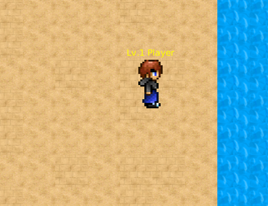
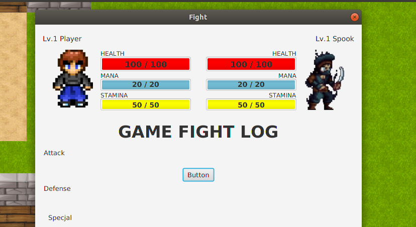

# Java_RPG_Game
Game based on youtube tutorial

FEATURES:
- player textures with animation
- two npc textures
- map generator
- map changing, when moving player to borders of screen
- textures of 11 tiles
- unfinished fight screen

TO DO:
- finish fight screen
- inventory for player
- more maps
- more npc
- mobs to fight with
- leveling system

